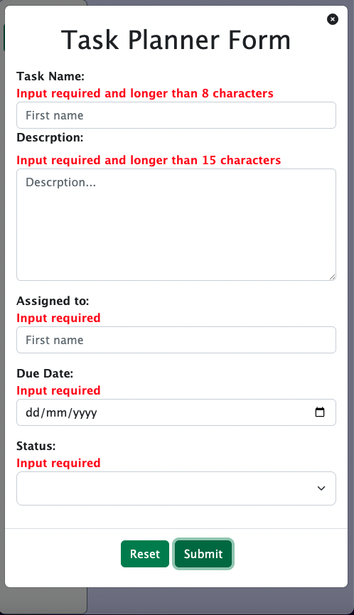

# TaskManager
1. About Project
    - TaskManager is a responsive web app to help users to organise tasks based on their task status. This project has used JavaScript localStorage, that means user data has been saved on the browser even after refreshing the page.
  
---

2. Languages
   - TaskManager App is built with HTML, CSS, Bootstrap and JavaScript Opp (Object Oriented Programming )

---

3. How to Install and Run the Project:
  
     ```
        git clone https://github.com/sophialai123/TaskManager.git

     ```

---

4. How to Use the Project:
   1. Press "Add Task" at the top right corner of the screen
   
   2. Fill the form information - note that all inputs are required
   
   3. Select the relevant task status - note that the tasks will be organised based on the status of the task
   
   4. Press the "Edit" button if you have completed your task. The button will then display as Mark as Done 
   
   5. Press the "Delete" button to delete the task 
   

---
## Desktop size and [Demo](https://sophialai123.github.io/TaskManager/)


---

## Mobile size   

| Input requirement    | Mark as Done               |
| -------------------- | -------------------------- |
|  |  |
