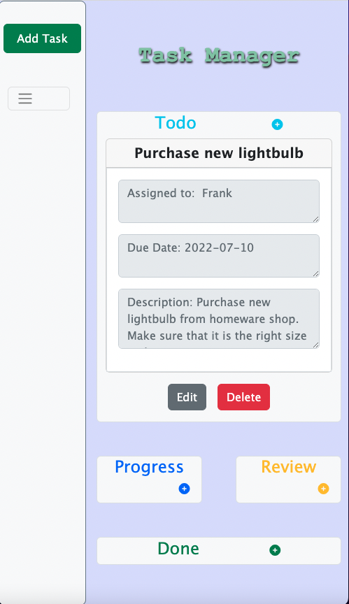

# TaskManager
1. About Project
    - TaskManager is a responsive web app to help users to orangize tasks based on their task status.This project has used the JavaScript localStorage, that means users's data has been saved on the browswer even after refreshing the page.
  
---

2. Languages
   - TaskManager App is built with Html,Css, Boostrap and  JavaScript Opp (Object Oriented Programming )

---

3. How to Install and Run the Project:
  
     ```
        git clone https://github.com/sophialai123/TaskManager.git

     ```

---

4. How to Use the Project:
   1. Press the top right button add task
   
   2. Fill the form information - note all the inputs are required
   
   3. Select task status - note the task will be added based on your task status
   
   4. Press the edit button if you have completed your task, will Mask as Done 
   
   5. Press the delete button to delete your task 
   

---
## Desktop size and [Demo](https://sophialai123.github.io/TaskManager/)


---

## Moblie size   

| Moblie size                | Mask as Done               |
| -------------------------- | -------------------------- |
|  |  |

